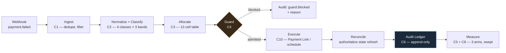
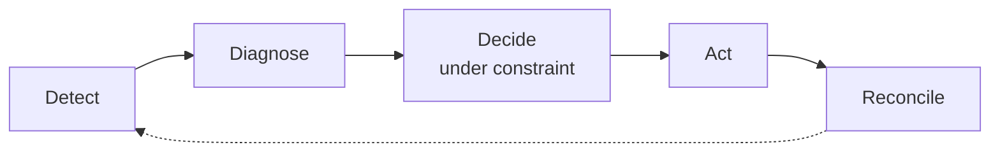
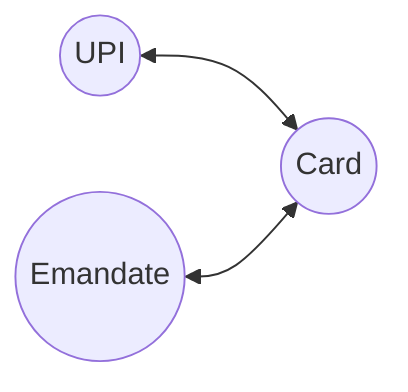

# Payment Failure Recovery — attempt allocation under a capped retry budget

Submission for the Razorpay AI Builder Internship 2026 — Track 03, AI Revenue Recovery.

**Status:** Phase 3 — all twelve components built. C1 event core, C2 classifier, C3 allocator,
C4 guard, C5 simulator and three arms, C6 audit ledger, C7 property invariants, C8 robustness
sweep, C9 calibration, C10 rail actions, C11 storm governor, C12 holdout harness.
The classifier's cost matrix and contact costs are authored. `mandate.class_multiplier`
was tested and deleted — see `ASSUMPTIONS.md`.



Every box is a component with its own module, its own tests, and its own line in
[`python -m recovery.reproduce`](#reproducing-results)'s output — nothing above is drawn from
memory of what the code does.

---

## Thesis

Retry volume for recurring debits is capped (1 original attempt + 3 retries). Under a fixed
ceiling, the open problem is not *retry better* — it is **how to allocate a scarce attempt
budget** across failures with different recovery dynamics, and how to prove that allocation
works without inventing the evidence.

## Against the brief

Track 03 asks for **an agent that detects revenue at risk, determines the right
intervention, and executes a bounded recovery workflow**, and sets the bar at
**measured money recovered across a batch, with compliant escalation, stopping rules,
and an audit trail.** Each of those is a specific thing in this repo, verifiable by one
command:

| Asked for | Here | Verify |
|---|---|---|
| **Detects** revenue at risk | C1 ingests `payment.failed`, dedupes on `x-razorpay-event-id`, filters registration artefacts, and refreshes authoritative state before deciding — never trusting the webhook body, because late auth means a payload saying `failed` can describe a live payment | `python -m recovery.reproduce` — C1 block |
| **Diagnoses** — root cause | C2 classifies `(method, source, step, reason)` into four causes with a confidence band | C2 block; `config/classifier.yaml` |
| **Determines the intervention** | C3, a twelve-cell table over cause × confidence. Four of twelve spend a capped execution; the other eight send a contact and spend none | `allocator/decisions.py` |
| **Executes** a **bounded** workflow | Bounded three ways: NPCI's 4-execution cap, a contact budget with cooldown, and a horizon. C4 admits every proposal or refuses it with a reason | `recovery/guard.py` |
| **Measured money across a batch** | Three arms, 500 cases, identical batches, swept across 100 sampled worlds | C5 + C8 blocks |
| **Compliant escalation** | Graduated by confidence, not by attempt number: recovery link → alternate channel → card-change offer (`OFFER_RAIL_MIGRATION`) → surrender. Every step is admitted or refused by C4 before it runs | `python -m recovery.explain --list` |
| **Stopping rules** | `SURRENDER`, on two triggers: the mandate-execution budget is exhausted, or a contact was made and no execution is worth spending on this class. Recorded as a decision with a reason, never as an absence — and it surrenders the *attempt budget*, not the customer | `python -m recovery.explain pay_SYNTHEXPIRED01` |
| **Audit trail** | Append-only, SQLite triggers block updates and deletes, every decision and every guard block reconstructable | `python -m recovery.explain --summary` |

**On "agent".** This is an agent in the loop sense the brief describes — it perceives,
diagnoses, decides under constraint, acts, and reconciles. What makes it one is the closed
loop, not the presence of a model.



Five verbs, one loop, closing on itself each cycle — not a single model call.

**There is exactly one model, and it cannot reach the money decision.** C13 reads
`error_description` — the one free-text field on the payload — with a local `llama3`
through Ollama, and may set `cause_family`, which shapes what a *contact says*. It cannot
change the class, the band, the confidence, or whether a capped execution is spent;
`refine()` diffs every other field and a test fails if one moves. It is cache-first and
offline: the parses are committed, so a clone with no model running gets identical
results.

**Why no model.** The classifier keys on `(method, source, step, reason)`, and all four
are documented enum fields. They are already structured; there is nothing to infer. A
model over them would be a lookup table with worse failure modes and no audit trail —
and it could not be trained honestly anyway, because there are no real labels. The only
labelled data here is five captured payloads and a synthetic batch whose classes I
assigned. A model fitted to that learns my own emission table, and its accuracy would
measure my consistency with myself (`CHALLENGES.md` 002).

**Where a model would earn its place, and does not yet exist.** `error_description` is
genuinely free text — *"try another payment method or contact your bank"* — and this
system does not read it at all. Parsing it into the schema is the one place an LLM would
add information rather than launder it. It is **not built**, and `NOT_BUILT.md` says so
rather than the README implying otherwise.

What is here instead is the part that is hard to get right: cost-sensitive decisions
under an explicit confidence model, an asymmetric cost matrix, and minimax resolution
toward the cheaper error when the class is itself a guess.

**On the mandate retry sequencer.** The brief names it as a direction. This is that,
taken literally and built to the depth where the constraint actually bites.

## What this is not

Razorpay already ships in-session dynamic routing (Optimizer / Smart Router), a documented
subscription retry schedule, and an Intelligent Retry Engine for merchant-configurable retry
strategies. This project does not duplicate any of them.

See `PRIOR_ART.md` for the full boundary analysis.

## Scope: one surface, deliberately

The track names four loss surfaces — payment failures, checkout abandonment,
subscription failures, and overdue receivables. This is one of them, built deeply
rather than four built thinly. Three reasons that is the better trade here:

- **The classifier generalises already.** It keys on `(method, source, step, reason)`,
  which every payment type carries. Nothing about the taxonomy is subscription-specific.
- **The allocator is not about subscriptions.** It is about spending a capped resource
  against outcomes with different recovery characteristics. Swap the cap and the action
  space and the twelve-cell table still applies.
- **The guard is where surface-specific constraints live.** NPCI's cap, the peak
  windows and the PDN lead are all in C4. A different surface changes the guard, not
  the decision structure above it.

The depth is the point: a capped budget with a regulator-defined action space is what
makes the allocation problem interesting, and subscriptions are where that constraint
actually bites. Breadth would have meant four shallow demonstrations of a problem whose
difficulty only appears at depth.

## Documents

| File | Contents |
|---|---|
| `CLAUDE.md` | Architecture, constraints, and hard rules |
| `PRIOR_ART.md` | What exists at Razorpay and where this layer sits |
| `CHALLENGES.md` | **What broke, and how I got out** — 20 entries, each with the diagnosis, the options rejected, and what it generalises to |
| `ASSUMPTIONS.md` | Every parameter, marked ordinal or cardinal, with sources |
| `NOT_BUILT.md` | Deliberately rejected scope, with reasons |
| `THREAT_MODEL.md` | What breaks in production that does not break here |
| `DLT_COMPLIANCE.md` | Open question: is a failure nudge promotional or transactional? |

Passages marked **[INFERRED]** are reconstruction rather than established fact, and are
marked so a reader can attack the reasoning instead of having to locate it first.

### What broke

`CHALLENGES.md` is the longest document here and the one I would read first. Every entry
is a real defect with the diagnosis, the options rejected and why, and what the failure
generalises to. Four worth opening:

- **017 — the allocator's main action was dead in production, and the simulator was
  green.** `SCHEDULE_AT` could never have been admitted, for any case, ever. The allocator
  chose a compliant execution slot; the decider protocol returned only `(action, reason)`
  and discarded it; the guard correctly refused an execution that named no time. Four
  components, each individually right. **The decision-trace CLI found it, not a test** —
  it printed the block reason where a log would have recorded that nothing happened.
- **002 — my evaluation was measuring my own assumptions.** The generator and the policy
  shared a parameter, so the result was partly circular. This is why the taxonomy is never
  fitted to the simulator's ground truth, and why there is no trained model.
- **009 — the safety invariant held perfectly while the system quietly stopped working.**
  A crashed worker abandoned its claimed jobs. Nothing was unsafe and nothing progressed.
- **015 — not every failure is a failure.** UPI mandate registration fires a validation
  debit that is *always* `status: failed`. It was opening cases, spending contacts, and
  inflating the denominator of every reported figure — a false positive that scales with
  the merchant's success.

Two of those four (015, 017) were found in the last week of the build, which is the
honest shape of it: the defects that survive longest are the ones where every component
is individually correct.

## Running

```
pip install -r requirements.txt
python -m pytest
python -m recovery.reproduce
```

## Reproducing results

```
python -m recovery.reproduce
```

Recreates the database from scratch and regenerates every claim in this README.
Nothing goes in this README that this command does not reproduce.

For a single page instead of a terminal scroll:

```
python -m recovery.report
```

writes `reports/report.html` — the same figures above, computed by the same functions
`reproduce.py` calls, not a second hand-typed copy of them. Gitignored: it is generated
output, and a committed HTML file is exactly the kind of figure that goes stale silently
once the code moves again, which is the thing this whole README exists to avoid.

**C1 — event core.** Replaying one webhook delivery ten times produces exactly one
case and one decision, with the full sequence visible in the audit trail: one
`webhook.received`, nine `webhook.duplicate_ignored`, one `payment.state_refreshed`,
one `case.opened`, one `decision.recorded`.

**C2 — classifier machinery.** Deterministic lookup over a table loaded from
`config/classifier.yaml`. The module contains no taxonomy: the mapping and the cost
matrix are hand-authored, and the loader refuses a file still marked `status: STUB`
unless a caller opts in explicitly.

An unmapped key is never silently defaulted — it reports `mapped=False`, zero
confidence, and emits `failure.unmapped` with the key that missed. Confidence is an
output: only a HIGH band permits excluding an instrument, because excluding on a
misdiagnosis makes recovery harder. A LOW band discards the predicted class and asks
the cost matrix which class has the lowest worst-case cost of being wrong — the
cheaper error, not the more likely class.

**Precedence is decided by which field a rule names, not how many.** `reason` outranks
`step`, which outranks `source`, which outranks `method` — so a rule naming only the
cause beats one naming the rail and the flow step. Counting named fields instead, which
is what this did until the mandate-registration rows were added, inverts that: the more
specific claim loses, the row never fires, and nothing says so. It is present, valid and
dead. `python -m recovery.coverage` reports which rows are unreachable, and the loader
rejects a rule naming a step outside `step_space` — a typo there produces exactly the
same silent dead row.

**Four rows are unreachable on purpose.** The `mandate_creation_*` rows classify
registration failures, and `payment.failed` is not triggered on an authorisation
failure — which is where mandate registration fails. So no event this system ingests can
produce those keys. They are marked `unreachable: true`, excluded from the coverage
argument, and kept because the classifier's job is to have an answer for a key that
exists rather than only for one that currently arrives.

Reaching them would need `subscription.pending` ingestion, and **a second ingest is
deliberately not built**. Registration drop-off is Razorpay's Intelligent Retry Engine's
territory, and duplicating a shipped product is the mistake `CHALLENGES.md` 001 exists to
record. It is listed in `NOT_BUILT.md` under revenue leaks identified and not addressed —
named rather than quietly skipped, because "we did not look" and "we looked and chose not
to" are different statements and only the second is a position.

**C5 + C3 — simulator and three arms.** A synthetic mandate-debit batch with a rail
dimension (Card / UPI / Emandate). Every cardinal value is sampled from a range, never
fixed. Ground truth is hidden: arms see only the emitted payload, and emission is
deliberately noisy so misclassification costs bind rather than decorate.

All figures below use the **`bounded-2026`** calibration profile, which is the default.
`--profile uncalibrated` runs the earlier guessed mix for comparison.

### One cycle, world seed 42

Mix drawn: INFRASTRUCTURE 48%, TERMINAL 36%, LIQUIDITY 10%, ATTENTION 6%.

| arm | recovered ₹ | attempts | contacts | wasted attempts | wasted contacts |
|---|---|---|---|---|---|
| A | 154,404.17 | 1,184 | 0 | 615 | 0 |
| B | 166,523.20 | 1,057 | 500 | 603 | 209 |
| C | **108,508.36** | 387 | 308 | **55** | 190 |

A→B contact uplift ₹12,119.03. B→C ₹−58,014.84. **Arm C recovers less in one cycle, and
that is the arm working as designed** — it withholds executions and contacts the other
arms spend. Share of the capped budget spent where recovery was impossible: A 52%,
B 57%, **C 14%**.

Switching from the guessed profile to the calibrated one moved Arm C's figure here from
₹143,135 to ₹108,508. That is not a regression: seed 42 under `bounded-2026` draws
INFRASTRUCTURE at 48% and TERMINAL at 36% — a world where most failures are transient and
retrying blindly works, so C should do badly. **Reporting the worse number under the more
defensible profile is the point.** The single-world figure was always a draw, not a result.

### The batch figure, at both units

One cycle is one unit. It is not the only one, and the bar does not name it — it asks for
money recovered across a batch. The same batch, measured over a stated remaining lifetime:

| months | A | B | **C** |
|---|---|---|---|
| 6 | 2,122,820–2,232,005 | 1,983,772–2,247,523 | **2,198,070–2,227,491** |
| 12 | 4,100,537–4,312,460 | 3,807,382–4,327,978 | **4,287,087–4,346,473** |
| 24 | 8,055,971–8,473,371 | 7,454,600–8,488,889 | **8,465,122–8,584,438** |

From 6 months on, **Arm C's worst case across the hazard range beats both other arms'
worst cases.** At 24 months its floor is ₹409k above the baseline's and ₹1.01M above
contact-everyone's.

**Labelled precisely, because the label is the whole point.** This is *value* — cycle
recovery plus the revenue of mandates still alive at that horizon — not cash collected
this month. It is a band across the swept hazard range at a fixed horizon, which is a
sensitivity and not an LTV estimate; there is no single number here and there is not
meant to be. Calling it "money recovered" would be the overstatement this project spends
its whole effort avoiding.

Both figures are the same batch. The cycle number is what the baseline optimises for; the
horizon number is what a mandate is actually worth.

### The claim: horizon crossover

A mandate is an annuity. An arm that recovers less now while keeping more mandates alive
is ahead from some remaining lifetime onward, and that lifetime is the claim.

At seed 42, swept across the hazard range: C overtakes B at **1.2–9.1 months**
of remaining lifetime and A at **1.9–6.7 months**.

**For fixed-count subscriptions the horizon is not an assumption at all.**
`remaining_count` is on every subscription payload, so remaining lifetime is *known*
per case and the crossover can be computed rather than swept. The sweep is the right
instrument only for open-ended subscriptions, where the horizon genuinely is unknown.
Treating every case as open-ended was leaving observable information on the table.

Over **100 sampled worlds per range set** — the default, so this table is what
`python -m recovery.reproduce` prints with no arguments:

| | vs A | vs B |
|---|---|---|
| C ahead by 6 months | 77% | 80% |
| C ahead by 12 months | **80%** | **89%** |
| C ahead by 24 months | 83% | 94% |
| Crossover p10 / median / p90 | 0.4 / 1.8 / 8.0 months | 0.7 / 2.8 / 8.6 |
| Ahead from the start | 37 worlds | 2 |
| Never overtakes | 15 worlds | 5 |

Arm B wins cycle recovery in **97% of worlds**. Arm C's case is entirely the horizon, and
that is stated rather than buried.

**Why 100 and not more.** Every figure in this README comes from the default invocation,
so a reader who clones this and runs one command gets these numbers and not a nearby set.
`--sweep-worlds 300` is stronger and moves them in C's favour — 83% and 90% at twelve
months — but a README that quotes a run the default does not produce is a README that
cannot be checked in the thirty seconds a reviewer will give it.

**Three conditions inside the calibrated ranges make this claim fail.** They belong next
to the claim rather than eighty lines below it, so they are named here and worked through
in [Where it breaks](#where-it-breaks):

| Condition | Against | Loss rate inside | Outside |
|---|---|---|---|
| `fatigue_multiplier` below ~1.218 | A | **40%** of 20 worlds | 15% of 80 |
| `class_mix_TERMINAL` below ~0.287 | A | **28%** of 60 worlds | 8% of 40 |
| `revocation_per_notification` below ~0.0155 | B | **30%** of 20 worlds | 6% of 80 |

An earlier version of this README said no condition separated wins from losses inside the
calibrated ranges. Three now do, and they arrived from making the model *more* accurate
rather than less — see below.

**The stump search is sample-size sensitive, and that is worth knowing before it is used
against the result.** Rerun at `--sweep-worlds 300` and the nominal-vs-A pair becomes
`class_mix_INFRASTRUCTURE` above ~0.301 and `class_mix_TERMINAL` below ~0.287.
`class_mix_TERMINAL` at the same threshold is the one condition stable across both sizes;
`fatigue_multiplier` and `class_mix_INFRASTRUCTURE` trade places with the sample. The
mechanism each names is real — what is unstable is which one ranks first, because a
decision stump reports a single best split and several are close. Treat the set as the
finding, never the ordering.

**These figures are weaker than the ones this README carried before the rail-conditional
revocation hazard landed, and the reason is worth stating.** Revocation was previously
modelled with one hazard across all three rails. There is no two-tap in-app cancel
gesture for a card mandate or an e-NACH — revoking those means contacting the bank — so
the UPI-shaped hazard was being applied where it does not belong, and it inflated exactly
the quantity Arm C's case rests on. Non-UPI rails now carry a near-zero hazard. Every
crossover figure moved against C, the median crossover against A moved from 1.6 to 2.3
months, and the p90 from 6.0 to 12.7. The claim survives; it survives with less room.

**Mandate survival is reported as an ordering, never a count** — a count would rest on a
per-notification revocation rate nobody publishes. At seed 42: `C > A > B` at every hazard
in the swept range, zero inversions.

**Halted preserves three things, not one** — and the earlier version of this README
had it wrong, saying only that mandate authority survived:

1. **Mandate authority.** The merchant can still charge manually.
2. **Reactivation on card change.** No customer re-authorisation needed.
3. **The skipped invoice, as a budget-free chargeable asset.** A skipped invoice stays
   chargeable after halt, and charging it **"does not increase the number of retries
   remaining"** — so it is recoverable revenue that costs nothing against the NPCI cap.

That third point changes the argument rather than decorating it. Halting is not merely
the cheaper failure; it *leaves an asset behind* that the documented baseline abandons.
Revoked destroys all three. C buys each avoided revocation with 3.0–7.9 additional halts against A and
2.2–9.9 against B, swept across the hazard range. Whether that is a good trade depends on
manual-recovery rates for halted subscriptions, which are not published.

### What the authored cost matrix changed: nothing, and that is the finding

Authoring the cost matrix moved the LOW-band resolution from ATTENTION to
TERMINAL — under the authored asymmetry, predicting TERMINAL has the lowest
worst-case cost, because mistaking a recoverable failure for TERMINAL surrenders
one payment while the reverse spends a capped execution *and* buys a failure
notification.

**Every reported figure above survives an active perturbation of the matrix.**
The check is not "it matches the stub" — that is a weak test, because two
matrices can agree by accident. The cost matrix is deliberately rewritten so
the LOW band resolves to a *different* class (ATTENTION instead of TERMINAL),
and the full sweep is repeated. Two lines of output change: the two C2
demonstration rows that print the resolved class. Every figure in this
README — the seed-42 table, the win rates, the crossover percentiles, the
breaking points — is byte-identical.

That is the LOW row of the decision table doing exactly what it was designed to
do. All four classes share one action at LOW confidence, so the class the cost
model resolves to never reaches a branch. The cost model changes what the audit
trail *records* about an uncertain case and cannot change what is *done* about
one — which is what "the LOW row is uniform by design" means when it is load
bearing rather than decorative.

The cost matrix still binds at MODERATE and HIGH, where the class does select
the cell. It is only under LOW — the band that exists precisely because the
class is a guess — that its answer is deliberately inert.

### Where it breaks

**This section previously said no condition separates wins from losses inside the
calibrated ranges. That is no longer true, and the change is the honest headline of this
run.** Under the rail-conditional hazard, three conditions now surface *inside* the
calibrated ranges rather than only under stress:

| Condition | Against | Loss rate inside | Outside |
|---|---|---|---|
| `fatigue_multiplier` below ~1.218 | A | 40% of 20 worlds | 15% of 80 |
| `class_mix_TERMINAL` below ~0.287 | A | 28% of 60 worlds | 8% of 40 |
| `revocation_per_notification` below ~0.0155 | B | 30% of 20 worlds | 6% of 80 |

`fatigue_multiplier` ranking first is the sharpest of these, and the least comfortable.
It governs how much each *additional* notification compounds revocation risk — below
roughly 1.22 the third notice is barely worse than the first, so the hazard stops
compounding, and compounding is the entire thing Arm C's withholding buys. Its range in
`config/worlds.yaml` is `[1.15, 1.60]`, so **the breaking point sits just above the
range's own floor.** There is no published figure to say whether that floor is right.

Under stress ranges deliberately widened past calibration the same conditions sharpen,
and `rail_mix_emandate` joins them:

> C loses where `revocation_per_notification` is below ~0.0215 — **40%** of those worlds
> against A, and below ~0.0150 **50%** against B, versus 6–13% elsewhere. Against A four
> more clear the threshold: `class_mix_INFRASTRUCTURE` above ~0.418 (53% of 19 worlds
> against 14%), `rail_mix_emandate` above ~0.129 (47% against 15%), `class_mix_TERMINAL`
> below ~0.116 (45% against 15%), and `emission_fidelity` below ~0.823 (27% of 70 worlds
> against 7%).

**`emission_fidelity` is the one to volunteer.** Arm C is the only arm that *acts on* the
class, so it is the only arm a mis-reported class can degrade; A and B ignore the
classification entirely and are structurally immune to its being wrong. A cause-aware
allocator's advantage over a cause-blind one is bounded above by how well the cause can be
read, and below roughly 0.82 the reading is poor enough that knowing-why stops paying for
itself. Inside the calibrated range it separates nothing. That is this project's own
precondition, and the sweep found it rather than the prose asserting it.

The mechanism is plain: if repeated failure notifications cost few mandates, protecting
mandates buys little and contacting everyone wins. That parameter is the least evidenced
number in the project, so **the result depends most on what can be defended least**. It is
volunteered rather than left to be discovered.

**`rail_mix_emandate` is the new model becoming visible, not a new weakness.**
E-mandate carries almost no revocation risk — there is no in-app cancel gesture for an
e-NACH, revoking one means contacting the bank — so an e-mandate-heavy world is one where
**the allocator's conservatism has little left to protect**. Arm C withholds attempts and
contacts to preserve mandates that were not going to be revoked anyway, and pays the
cycle-recovery cost for nothing.

This condition could not have appeared under the single-hazard model, because that model
had no way to express a rail where revocation is rare. Making the hazard rail-conditional
did not introduce the weakness; it made an existing one measurable. The same is true of
the three in-range conditions above: a sweep that cannot represent a distinction cannot
find the failure mode that lives in it.

### What calibration exposed — the stronger result

The crossover surviving calibration is reassuring. This is the more interesting finding.

The guessed mix pinned INFRASTRUCTURE at 10–25% and TERMINAL at 10–25%. Two conditions
under which Arm C loses sit **outside those ranges**:

| Condition | Loss rate inside | Outside |
|---|---|---|
| `class_mix_INFRASTRUCTURE` above ~0.418 | 53% of 19 worlds | 14% of 81 |
| `class_mix_TERMINAL` below ~0.116 | 45% of 20 worlds | 15% of 80 |

The old sweep **structurally could not sample either region**, however many worlds it drew.
A sweep confined to a guessed range does not test the guess; it tests everything except the
guess. That is the argument for bounding a parameter rather than assuming it, and it is a
stronger claim than the crossover holding: the calibrated sweep found real failure modes
the guessed one was incapable of finding.

**C9 — calibration.** Sources in `data/`, each with a `.source.md` sidecar recording
origin, retrieval date and provenance **per figure** — Razorpay is primary for claims
about its own stack and secondary where it cites unattributed industry data, and the same
document contains both.

```
python -m recovery.calibration
```

The four-way split is not in the published data. Razorpay's figure covers three classes in
one number — "insufficient balance, bank downtime, or cancelled mandates" — and never
mentions the fourth. So `bounded-2026` does not map it: the split is **swept across the
full simplex** and ATTENTION bounded as a residual, with the profile's `interpretation`
field stating that the split is unavailable and therefore swept rather than assumed. A
profile claiming to be calibrated cannot load without that field.

Issuer outage *is* sourced: four months of NPCI per-bank downtime give a mean of
0.57%–0.78% of the month per affected bank, a per-bank range of 0.08%–2.65%, and 25
distinct banks of which two — Central Bank of India and Punjab National Bank — appear in
every month. It is deliberately **not** used to set the INFRASTRUCTURE share, because
converting outage hours into a share of failures needs transaction volume during outage
windows that no file provides.

**C10 — rail actions.** Executes the shaping the allocator emits, on a recovery Payment
Link. This is the **out-of-session** case and that boundary is the point: Optimizer
already does in-session fallback routing, so nothing here competes with it. This is the
link sent *afterwards*, to a customer who has already gone — where there is no session
to fall back within.

Reorder promotes via `sequence` and removes nothing. Exclusion builds an allowlist
(`show_default_blocks: false`) and is **gated to the HIGH band**, because excluding on a
misdiagnosis leaves the customer without the method they would have used, on a page they
already abandoned once. Reorder costs nothing if wrong; exclusion costs the recovery.

`OFFER_RAIL_MIGRATION` builds an *offer* validated against the documented graph — manual
charging of a domestic card is not supported, so there is no version that executes.



Card is the only hub. UPI and Emandate can each migrate to Card and back, but never to
each other — Razorpay does not document why, and `CLAUDE.md`'s "Still open" list records
that as a question rather than an assumed answer.

**Dispatch is real, not simulated-only.** `recovery/executor.py` mirrors the gateway's
adapter pattern: `SimulatedExecutor` is the default everywhere — the worker, every test,
every reported figure — and `RazorpayExecutor` is stdlib `urllib` against Razorpay's
actual test-mode Payment Links API, gated to `rzp_test_` keys at construction, the same
guard `RazorpayGateway` already carried on the read side.

```bash
python -m recovery.reproduce --live-razorpay
```

dispatches one real link for the TERMINAL/HIGH trace case and prints back a real `id`
and `short_url`. Off by default — no figure in this README depends on the network call
having happened. `SCHEDULE_AT` gets no live counterpart, deliberately: there is no API
that lets a third party force a mandate execution, the same reason `ATTEMPT_NOW` is
absent from the action space at all.

**C11 — storm governor.** Jitter plus a per-issuer admission ceiling. Regulatory basis:
NPCI directs PSPs to initiate executions at moderated TPS and may apply rate limiters.
Scheduling T+1 for every failure in a batch produces exactly that spike, aimed at
whichever issuer caused the batch to fail.

**There is no issuer list, and a test enforces that there never is.** The NPCI data shows
outages rotate — 12 of 25 banks appear in exactly one month — and the second persistent
bank looked fine in April (1.67h) and was five times worse by June (9.40h). A blocklist
built from April's data misses it. The ceiling is a function of observed conditions in a
rolling window, so an issuer that degrades is throttled automatically and one that
recovers is released without anyone editing a file.

Thresholds come from the sourced outage distribution in `bounded-2026`, so "degraded"
means *worse than what NPCI actually published*. Jitter is derived from the case key, not
drawn at random: a retried worker must reschedule to the same slot or the audit trail
stops reconstructing. It only ever moves forward, because moving earlier could cross the
PDN lead time or walk into a peak window.

**C12 — holdout harness.** A routing flag sending a stratified fraction of eligible cases
to the documented baseline on real traffic, with uplift computed from realised outcomes.

**Its value is the claim, not the code.** Every rupee figure here is simulated, and an
uplift measured against a hand-written generator measures the ability to invert it. So
magnitude is not claimed — and "we cannot measure magnitude on synthetic data, here is
the instrument that would measure it on real volume" is only credible if the instrument
exists.

Assignment is a hash of the chain key and experiment name: no stored state, so a replayed
webhook cannot move a case between arms mid-experiment, and assignment survives a restart
because there is nothing to survive. Stratified by rail and failure class, because an
unstratified 10% holdout can draw a TERMINAL-heavy control and make the treatment look
good for reasons unrelated to the policy. Uplift is stratum-weighted rather than pooled,
and the output states in as many words that it is **not** a significance test.

**C6 — audit ledger.** A query surface over the append-only trail, and a decision trace.

`python -m recovery.reproduce` writes the ledger; these then work against it with no
further arguments:

```bash
python -m recovery.explain pay_SYNTHEXPIRED01
```

```bash
python -m recovery.explain --list
```

```bash
python -m recovery.explain --summary
```

Resolves by case id, order id, or any payment on the chain — whoever asks "why did this
happen" has whichever identifier the complaint arrived with. **Payment and order ids are
fixed strings, not generated**, so an id printed in this README is the id in your ledger;
case ids are uuids and are not quotable.

The trace names the classification, the decision and its idempotency key, and **every
guard block with its reason**: a case that did nothing shows why, because "no decision"
and "a decision the guard refused" are different facts. The ledger holds no write path,
enforced by a test.

### The cell the thesis rests on

`pay_SYNTHEXPIRED01` is an expired card — TERMINAL at HIGH confidence, the one class
where `P(retry succeeds) = 0` holds by definition:

```
  classified TERMINAL at HIGH (confidence 0.99), family instrument
  key        card/issuer_bank/payment_authorization/payment_expired_card

  OUTCOME    OFFER_RAIL_MIGRATION - TERMINAL (HIGH, confidence 0.99) -> cell
             spends_execution=false, contact=card_change_offer: retry cannot succeed
             by definition; the only path is a customer-entered instrument

  decisions:
    attempt 1  OFFER_RAIL_MIGRATION  [recovery:pay_SYNTHEXPIRED01:0.1.0:1]
```

`spends_execution=false` is the whole argument in one field. The documented baseline
spends T+1, T+2 and T+3 on this card and halts; the allocator spends **zero** of the
capped budget and sends a card-change offer instead, because a card-change offer is the
only action that can convert on a dead instrument. Three executions are returned to the
mandate, and the customer receives one message that can be acted on rather than three
that cannot.

`reproduce` materialises one case per cell — TERMINAL/HIGH, LIQUIDITY/HIGH,
ATTENTION/HIGH and a LOW-band generic decline — so the four decisions can be compared
side by side. They are real decisions from the real allocator, not display fixtures: if
a cell changes, that output changes with it.

**C4 — the guard.** Admission control between Allocate and Execute; every proposal
passes through. Mandate-execution cap, non-peak windows, PDN lead time with the 23:50
cutoff, prior-attempt-resolved for Emandate, contact budget and cooldown, order validity
and expiry, payment-not-already-succeeded, idempotency.

Separate from the allocator on purpose: an allocator that polices itself cannot be
audited against its own rules, and every arm must face identical admission rules or the
comparison measures which arm remembered the regulations. **Every block carries a
reason and is attributable per arm**, so what an arm *tried* stays visible next to what
it was *allowed* to do.

**Two event sources, joined on the chain.** `payment.failed` is the payment-level
view and is the only one carrying the error fields the classifier keys on.
`subscription.pending` is the *mandate-level* failure signal and fires again on each
subsequent failure; `subscription.halted` is budget exhaustion. Both are needed:
the payment event says *why*, the subscription event says *where in the budget*, and
`auth_attempts` on the subscription payload is the authoritative execution count.

Dedup is on `x-razorpay-event-id` — a header, not a body field. Delivery is
at-least-once and duplicates are expected, so a duplicate is acknowledged 2xx and
logged, never rejected: 24h of non-2xx disables the webhook.

Decisions read authoritative payment state fetched from the API, never the webhook
payload. A payment marked `Failed` can become `Authorized` for up to three days
while Razorpay polls the bank, and every T+1/T+2/T+3 retry lands inside that window.

## License

MIT
